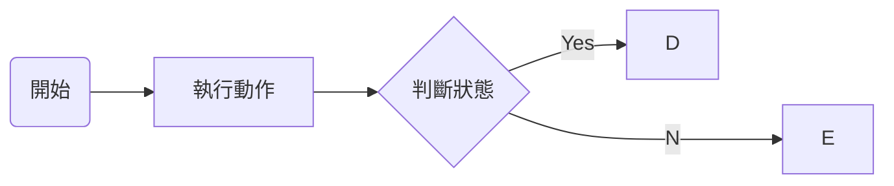
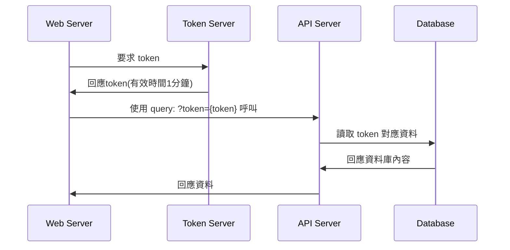
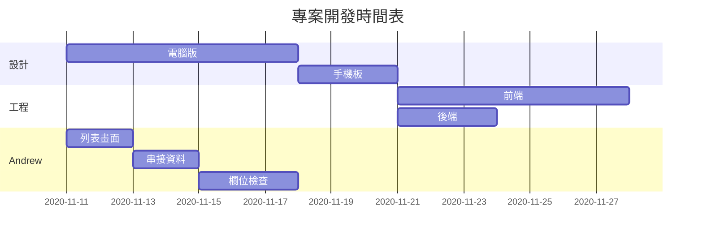

# This is h1 title
***
這是內文喔這是內文喔
這是內文喔這是內文喔這是內文喔
這是內文喔這是內文喔這是內文喔這是內文喔這是內文喔這是內文喔

## This is h2
***
這是內文喔這是內文喔這是內文喔這是內文喔這是內文喔這是內文喔這是內文喔

> 這是引言
Markdown的目標是實現「易讀易寫」。
>
>Markdown不是要來取代HTML，甚至也沒有要和它相似，它的*語法種類*不多，只和HTML的一部分有關係，**重點**不是要創造一種更容易寫作HTML文件的語法，我認為HTML已經很容易寫了，Markdow的重點在於，它能讓文件更容易閱讀、編寫。HTML 是一種發佈的格式，Markdown是一種編寫的格式，因此，Markdown的格式語法***只涵蓋***純文字可以涵蓋的範圍。


Markdown不是要來取代HTML，甚至也沒有要和它相似，它的語法種類不多，只和HTML的一部分有關係，**重點**不是要創造一種更容易寫作HTML文件的語法，我認為HTML已經很容易寫了，Markdow的重點在於，`它能讓文件更容易閱讀、編寫。HTML 是一種發佈的格式，Markdown是一種編寫的格式`，因此，Markdown的格式語法純文字可以涵蓋的範圍。

```javascript
window.alert("AAA")
```

[Google]:https://www.google.com "Google"
[Yahoo]:https://www.yahoo.com "Yahoo"
[IMG_MD]:https://markdown.tw/images/208x128.png "Markdown"

this is [Google]
this is [Yahoo]
![IMG_MD]

- HTML
- CSS
- Javascript

1.HTML
1.CSS
1.Javascript

- [ ] html
- [x] css
- [ ] ~~javascript~~

|HTML|CSS|Javascript|
|-:|:--:|--|
|5|3|ES6|








