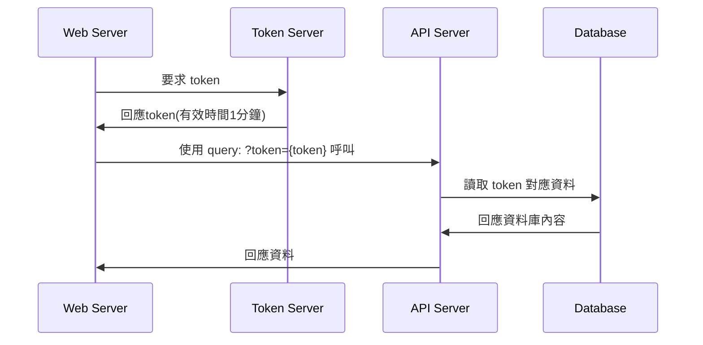
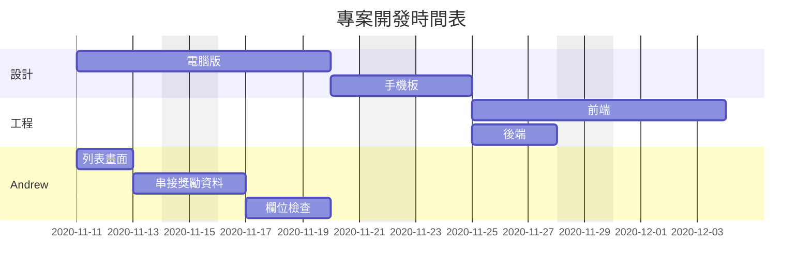

```mermaid
sequenceDiagram
participant A as Web Server
participant B as Token Server
participant C as API Server
participant D as Database

A ->> B: 要求 token
B ->> A: 回應token(有效時間1分鐘)
A ->> C: 使用 query: ?token={token} 呼叫
C ->> D: 讀取 token 對應資料
D ->> C: 回應資料庫內容
C ->> A: 回應資料
```

```mermaid
gantt
title 專案開發時間表
excludes weekends
section 設計
電腦版: d1,2020-11-11,7d
手機板: d2,after d1, 3d
section 工程
前端: after d2, 7d
後端: after d2, 3d


section Andrew
列表畫面: a1,2020-11-11,2d
串接獎勵資料: a2,after a1,2d
欄位檢查: after a2,3d
```

